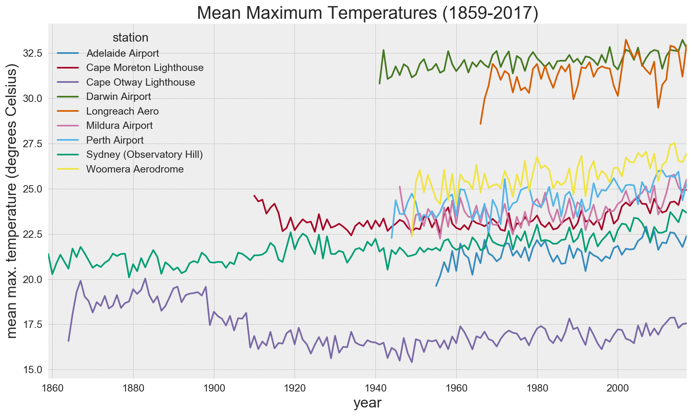

## BOM maximum and minimum temperature trends

### 1. Data preparation
Perform imports of required packages. Convert the contents of daily maximum and minimum BOM data into pandas dataframes.
Concatenate individual dataframes into a single dataframe for mean maximum and mean minimum temperatures.
Data source: http://www.bom.gov.au/climate/data/index.shtml


```python
# Perform imports, set styles and path
import pandas as pd
import matplotlib.pyplot as plt
import pandas as pd
import seaborn as sns; sns.set()
import numpy as np
import matplotlib as mpl
%pylab inline
%config InlineBackend.figure_format = 'retina'
sns.set(font_scale = 1.25)
plt.style.use('bmh')
path = 'C:/Users/Grant/Documents/jupyter notebooks/bom-temperatures/'

# Convert contents of daily maximun temp CSV files from BOM website to pandas dataframes
df1 = pd.read_csv(path + 'IDCJAC0010_66062_1800_Data.csv')
df2 = pd.read_csv(path + 'IDCJAC0010_40043_1800_Data.csv')
df3 = pd.read_csv(path + 'IDCJAC0010_76031_1800_Data.csv')
df4 = pd.read_csv(path + 'IDCJAC0010_23034_1800_Data.csv')
df5 = pd.read_csv(path + 'IDCJAC0010_14015_1800_Data.csv')
df6 = pd.read_csv(path + 'IDCJAC0010_9021_1800_Data.csv')
df7 = pd.read_csv(path + 'IDCJAC0010_036031_1800_Data.csv')
df8 = pd.read_csv(path + 'IDCJAC0010_016001_1800_Data.csv')
df9 = pd.read_csv(path + 'IDCJAC0010_90015_1800_Data.csv')

# Concatenate daily max temp weather station data
frames = [df1, df2, df3, df4, df5, df6, df7, df8, df9]
temp_data_max = pd.concat(frames)

# Convert contents of daily minimum temp CSV files from BOM website to pandas dataframes
df21 = pd.read_csv(path + 'IDCJAC0011_66062_1800_Data.csv')
df22 = pd.read_csv(path + 'IDCJAC0011_40043_1800_Data.csv')
df23 = pd.read_csv(path + 'IDCJAC0011_76031_1800_Data.csv')
df24 = pd.read_csv(path + 'IDCJAC0011_23034_1800_Data.csv')
df25 = pd.read_csv(path + 'IDCJAC0011_14015_1800_Data.csv')
df26 = pd.read_csv(path + 'IDCJAC0011_9021_1800_Data.csv')
df27 = pd.read_csv(path + 'IDCJAC0011_036031_1800_Data.csv')
df28 = pd.read_csv(path + 'IDCJAC0011_016001_1800_Data.csv')
df29 = pd.read_csv(path + 'IDCJAC0011_90015_1800_Data.csv')

# Concatenate daily min temp weather station data
frames_min = [df21, df22, df23, df24, df25, df26, df27, df28, df29]
temp_data_min = pd.concat(frames_min)
```

    Populating the interactive namespace from numpy and matplotlib
    

Read in further data as the station name is more useful than station number. Geo data could be used later if necessary.


```python
# Read in temp_geo subset, which contains meaningful weather station names and location data if required
temp_geo = pd.read_csv(path + 'temp_geo.csv')
temp_geo

```


<div>
<table border="1" class="dataframe">
  <thead>
    <tr style="text-align: right;">
      <th></th>
      <th>Bureau of Meteorology station number</th>
      <th>Station</th>
      <th>Lat</th>
      <th>Lon</th>
      <th>Elevation</th>
    </tr>
  </thead>
  <tbody>
    <tr>
      <th>0</th>
      <td>66062</td>
      <td>Sydney (Observatory Hill)</td>
      <td>-33.86</td>
      <td>151.21</td>
      <td>39</td>
    </tr>
    <tr>
      <th>1</th>
      <td>40043</td>
      <td>Cape Moreton Lighthouse</td>
      <td>-27.03</td>
      <td>153.47</td>
      <td>100</td>
    </tr>
    <tr>
      <th>2</th>
      <td>76031</td>
      <td>Mildura Airport</td>
      <td>-34.24</td>
      <td>142.09</td>
      <td>50</td>
    </tr>
    <tr>
      <th>3</th>
      <td>90015</td>
      <td>Cape Otway Lighthouse</td>
      <td>-38.86</td>
      <td>143.51</td>
      <td>82</td>
    </tr>
    <tr>
      <th>4</th>
      <td>23034</td>
      <td>Adelaide Airport</td>
      <td>-34.95</td>
      <td>138.52</td>
      <td>2</td>
    </tr>
    <tr>
      <th>5</th>
      <td>9021</td>
      <td>Perth Airport</td>
      <td>-31.93</td>
      <td>115.98</td>
      <td>15</td>
    </tr>
    <tr>
      <th>6</th>
      <td>14015</td>
      <td>Darwin Airport</td>
      <td>-12.42</td>
      <td>130.89</td>
      <td>30</td>
    </tr>
    <tr>
      <th>7</th>
      <td>36031</td>
      <td>Longreach Aero</td>
      <td>-23.44</td>
      <td>144.28</td>
      <td>192</td>
    </tr>
    <tr>
      <th>8</th>
      <td>16001</td>
      <td>Woomera Aerodrome</td>
      <td>-31.16</td>
      <td>136.81</td>
      <td>167</td>
    </tr>
  </tbody>
</table>
</div>


Merge minimum and maximum temperature data.


```python
# Merge max and min temperature dataframes...
temp_data_all = pd.merge(temp_data_max, temp_data_min, how='left',
                         left_on=['Bureau of Meteorology station number', 'Year', 'Month', 'Day'],
                        right_on=['Bureau of Meteorology station number', 'Year', 'Month', 'Day'])
```


```python
# Merge station subset
temp_data_all = pd.merge(temp_data_all, temp_geo, how='left', 
                         left_on='Bureau of Meteorology station number',
                        right_on='Bureau of Meteorology station number')
```

Review the combined dataframe.


```python
temp_data_all.head()
```


<div>
<table border="1" class="dataframe">
  <thead>
    <tr style="text-align: right;">
      <th></th>
      <th>Product code_x</th>
      <th>Bureau of Meteorology station number</th>
      <th>Year</th>
      <th>Month</th>
      <th>Day</th>
      <th>Maximum temperature (Degree C)</th>
      <th>Days of accumulation of maximum temperature</th>
      <th>Quality_x</th>
      <th>Product code_y</th>
      <th>Minimum temperature (Degree C)</th>
      <th>Days of accumulation of minimum temperature</th>
      <th>Quality_y</th>
      <th>Station</th>
      <th>Lat</th>
      <th>Lon</th>
      <th>Elevation</th>
    </tr>
  </thead>
  <tbody>
    <tr>
      <th>0</th>
      <td>IDCJAC0010</td>
      <td>66062</td>
      <td>1859</td>
      <td>1</td>
      <td>1</td>
      <td>24.4</td>
      <td>NaN</td>
      <td>Y</td>
      <td>IDCJAC0011</td>
      <td>14.5</td>
      <td>NaN</td>
      <td>Y</td>
      <td>Sydney (Observatory Hill)</td>
      <td>-33.86</td>
      <td>151.21</td>
      <td>39</td>
    </tr>
    <tr>
      <th>1</th>
      <td>IDCJAC0010</td>
      <td>66062</td>
      <td>1859</td>
      <td>1</td>
      <td>2</td>
      <td>24.4</td>
      <td>1.0</td>
      <td>Y</td>
      <td>IDCJAC0011</td>
      <td>15.7</td>
      <td>1.0</td>
      <td>Y</td>
      <td>Sydney (Observatory Hill)</td>
      <td>-33.86</td>
      <td>151.21</td>
      <td>39</td>
    </tr>
    <tr>
      <th>2</th>
      <td>IDCJAC0010</td>
      <td>66062</td>
      <td>1859</td>
      <td>1</td>
      <td>3</td>
      <td>24.2</td>
      <td>1.0</td>
      <td>Y</td>
      <td>IDCJAC0011</td>
      <td>15.3</td>
      <td>1.0</td>
      <td>Y</td>
      <td>Sydney (Observatory Hill)</td>
      <td>-33.86</td>
      <td>151.21</td>
      <td>39</td>
    </tr>
    <tr>
      <th>3</th>
      <td>IDCJAC0010</td>
      <td>66062</td>
      <td>1859</td>
      <td>1</td>
      <td>4</td>
      <td>24.7</td>
      <td>1.0</td>
      <td>Y</td>
      <td>IDCJAC0011</td>
      <td>17.4</td>
      <td>1.0</td>
      <td>Y</td>
      <td>Sydney (Observatory Hill)</td>
      <td>-33.86</td>
      <td>151.21</td>
      <td>39</td>
    </tr>
    <tr>
      <th>4</th>
      <td>IDCJAC0010</td>
      <td>66062</td>
      <td>1859</td>
      <td>1</td>
      <td>5</td>
      <td>24.6</td>
      <td>1.0</td>
      <td>Y</td>
      <td>IDCJAC0011</td>
      <td>16.9</td>
      <td>1.0</td>
      <td>Y</td>
      <td>Sydney (Observatory Hill)</td>
      <td>-33.86</td>
      <td>151.21</td>
      <td>39</td>
    </tr>
  </tbody>
</table>
</div>


```python
print (temp_data_all.shape)
```

    (302845, 16)
    

Enhance the dataframe with an aggregation column called 'decade'. Then perform a clean up of unecesary columns created in the merge process.


```python
# Create decade variable for grouping BOM temperature data
# Take a quick look at the dataframe

temp_data_all['decade'] = 10 * (temp_data_all['Year'] // 10)
temp_data_all['decade'] = temp_data_all['decade'].astype(str) + 's' 
print (temp_data_all.shape)
temp_data_all.head()
```

    (302845, 17)
    


<div>
<table border="1" class="dataframe">
  <thead>
    <tr style="text-align: right;">
      <th></th>
      <th>Product code_x</th>
      <th>Bureau of Meteorology station number</th>
      <th>Year</th>
      <th>Month</th>
      <th>Day</th>
      <th>Maximum temperature (Degree C)</th>
      <th>Days of accumulation of maximum temperature</th>
      <th>Quality_x</th>
      <th>Product code_y</th>
      <th>Minimum temperature (Degree C)</th>
      <th>Days of accumulation of minimum temperature</th>
      <th>Quality_y</th>
      <th>Station</th>
      <th>Lat</th>
      <th>Lon</th>
      <th>Elevation</th>
      <th>decade</th>
    </tr>
  </thead>
  <tbody>
    <tr>
      <th>0</th>
      <td>IDCJAC0010</td>
      <td>66062</td>
      <td>1859</td>
      <td>1</td>
      <td>1</td>
      <td>24.4</td>
      <td>NaN</td>
      <td>Y</td>
      <td>IDCJAC0011</td>
      <td>14.5</td>
      <td>NaN</td>
      <td>Y</td>
      <td>Sydney (Observatory Hill)</td>
      <td>-33.86</td>
      <td>151.21</td>
      <td>39</td>
      <td>1850s</td>
    </tr>
    <tr>
      <th>1</th>
      <td>IDCJAC0010</td>
      <td>66062</td>
      <td>1859</td>
      <td>1</td>
      <td>2</td>
      <td>24.4</td>
      <td>1.0</td>
      <td>Y</td>
      <td>IDCJAC0011</td>
      <td>15.7</td>
      <td>1.0</td>
      <td>Y</td>
      <td>Sydney (Observatory Hill)</td>
      <td>-33.86</td>
      <td>151.21</td>
      <td>39</td>
      <td>1850s</td>
    </tr>
    <tr>
      <th>2</th>
      <td>IDCJAC0010</td>
      <td>66062</td>
      <td>1859</td>
      <td>1</td>
      <td>3</td>
      <td>24.2</td>
      <td>1.0</td>
      <td>Y</td>
      <td>IDCJAC0011</td>
      <td>15.3</td>
      <td>1.0</td>
      <td>Y</td>
      <td>Sydney (Observatory Hill)</td>
      <td>-33.86</td>
      <td>151.21</td>
      <td>39</td>
      <td>1850s</td>
    </tr>
    <tr>
      <th>3</th>
      <td>IDCJAC0010</td>
      <td>66062</td>
      <td>1859</td>
      <td>1</td>
      <td>4</td>
      <td>24.7</td>
      <td>1.0</td>
      <td>Y</td>
      <td>IDCJAC0011</td>
      <td>17.4</td>
      <td>1.0</td>
      <td>Y</td>
      <td>Sydney (Observatory Hill)</td>
      <td>-33.86</td>
      <td>151.21</td>
      <td>39</td>
      <td>1850s</td>
    </tr>
    <tr>
      <th>4</th>
      <td>IDCJAC0010</td>
      <td>66062</td>
      <td>1859</td>
      <td>1</td>
      <td>5</td>
      <td>24.6</td>
      <td>1.0</td>
      <td>Y</td>
      <td>IDCJAC0011</td>
      <td>16.9</td>
      <td>1.0</td>
      <td>Y</td>
      <td>Sydney (Observatory Hill)</td>
      <td>-33.86</td>
      <td>151.21</td>
      <td>39</td>
      <td>1850s</td>
    </tr>
  </tbody>
</table>
</div>


```python
# Perform cleanup by dropping unecessary columns from temp_data_all
print (temp_data_all.shape)
temp_data_all = temp_data_all.drop(['Product code_x', 'Product code_y', 'Days of accumulation of maximum temperature',
                                   'Days of accumulation of minimum temperature', 'Quality_x', 'Quality_y'], axis=1) 
print (temp_data_all.shape)

```

    (302845, 17)
    (302845, 11)
    


```python
# Convert column headers to lowercase and remove spaces
temp_data_all.columns = temp_data_all.columns.str.lower().str.replace(' ', '_')

# Abbreviate long names..
temp_data_all.rename(columns={'bureau_of_meteorology_station_number' : 'station_number',
'maximum_temperature_(degree_c)' : 'max_temp',
'minimum_temperature_(degree_c)' : 'min_temp'}, inplace=True)
# Check
print (temp_data_all.columns)
```

    Index(['station_number', 'year', 'month', 'day', 'max_temp', 'min_temp',
           'station', 'lat', 'lon', 'elevation', 'decade'],
          dtype='object')
    

While the amount of missing data below seems like a lot, overall it is not excessive. I have decided to drop them where necessary, rather than trying to impute values, as the accuracy would likely be similar.


```python
# Check the number of NaNs (missing data)
print (temp_data_all.isnull().sum())
```

    station_number       0
    year                 0
    month                0
    day                  0
    max_temp          4959
    min_temp          4427
    station              0
    lat                  0
    lon                  0
    elevation            0
    decade               0
    dtype: int64
    


```python
# Drop 2018 values to avoid temperature distortions because it is not a full year of data
temp_data_all = temp_data_all[(temp_data_all['year'] >= 1859) & (temp_data_all['year'] < 2018)]
# Check
temp_data_all.tail()
```


<div>
<table border="1" class="dataframe">
  <thead>
    <tr style="text-align: right;">
      <th></th>
      <th>station_number</th>
      <th>year</th>
      <th>month</th>
      <th>day</th>
      <th>max_temp</th>
      <th>min_temp</th>
      <th>station</th>
      <th>lat</th>
      <th>lon</th>
      <th>elevation</th>
      <th>decade</th>
    </tr>
  </thead>
  <tbody>
    <tr>
      <th>302764</th>
      <td>90015</td>
      <td>2017</td>
      <td>12</td>
      <td>27</td>
      <td>33.8</td>
      <td>17.3</td>
      <td>Cape Otway Lighthouse</td>
      <td>-38.86</td>
      <td>143.51</td>
      <td>82</td>
      <td>2010s</td>
    </tr>
    <tr>
      <th>302765</th>
      <td>90015</td>
      <td>2017</td>
      <td>12</td>
      <td>28</td>
      <td>19.0</td>
      <td>17.7</td>
      <td>Cape Otway Lighthouse</td>
      <td>-38.86</td>
      <td>143.51</td>
      <td>82</td>
      <td>2010s</td>
    </tr>
    <tr>
      <th>302766</th>
      <td>90015</td>
      <td>2017</td>
      <td>12</td>
      <td>29</td>
      <td>17.8</td>
      <td>13.8</td>
      <td>Cape Otway Lighthouse</td>
      <td>-38.86</td>
      <td>143.51</td>
      <td>82</td>
      <td>2010s</td>
    </tr>
    <tr>
      <th>302767</th>
      <td>90015</td>
      <td>2017</td>
      <td>12</td>
      <td>30</td>
      <td>17.8</td>
      <td>14.4</td>
      <td>Cape Otway Lighthouse</td>
      <td>-38.86</td>
      <td>143.51</td>
      <td>82</td>
      <td>2010s</td>
    </tr>
    <tr>
      <th>302768</th>
      <td>90015</td>
      <td>2017</td>
      <td>12</td>
      <td>31</td>
      <td>18.7</td>
      <td>14.1</td>
      <td>Cape Otway Lighthouse</td>
      <td>-38.86</td>
      <td>143.51</td>
      <td>82</td>
      <td>2010s</td>
    </tr>
  </tbody>
</table>
</div>


### 2. Time Series Visualisation

Use the pivot_table function to convert the data into a wide format, suitable for time series analysis.

The below line plot highlights an upward trend in mean maximum temperatures, particularly from around the mid 1940s until the end of 2017. The second plot shows a zoomed in view from 1946 onwards.


```python
# Plot mean maximum temperatures over time.
temp_data_all.pivot_table('max_temp',
                          index='year', columns='station',
                          aggfunc='mean').plot(figsize=(14, 8)) 


plt.title('Mean Maximum Temperatures (1859-2017)')
plt.ylabel('mean max. temperature (degrees celsius)');
```





```python
# Zoom into the above plot from 1946, from which point the trend seems consistent.
temp_data_all[temp_data_all['year'] > 1945].pivot_table('max_temp',
                          index='year', columns='station',
                          aggfunc='mean').plot(figsize=(14, 8)) 


plt.title('Mean Maximum Temperatures (1946-2017)')
plt.ylabel('mean max. temperature (degrees celsius)');
```


The below line plot similarly, highlights an upward trend in mean minimum temperatures. The trends at Darwin Airport and Mildura Airport seems to be relatively static compared to the others.


```python
# Plot mean minimum temperatures over time.
temp_data_all.pivot_table('min_temp',
                          index='year', columns='station',
                          aggfunc='mean').plot(figsize=(14, 8)) 


plt.title('Mean Minimum Temperatures (1859-2017)')
plt.ylabel('mean min. temperature (degrees celsius)');
```


```python
# Zoom into the above plot from 1946, from which point the trend seems consistent.
temp_data_all[temp_data_all['year'] > 1945].pivot_table('min_temp',
                          index='year', columns='station',
                          aggfunc='mean').plot(figsize=(14, 8)) 


plt.title('Mean Minimum Temperatures (1946-2017)')
plt.ylabel('mean min. temperature (degrees celsius)');
```


The pivot table below shows the trend indexed by decade as opposed to years. The mean increase in maximum temperatures between the 1960s and 2010s is the highest in the temperate stations of Perth Airport, followed by Woomera Aerodrome and Mildura Airport.

Note: the 2010s are not complete so this variance could increase by the end of December 2019.


```python
# Pivot on mean maximum & minimum temperatures across weather stations by decades
temp_data_all.pivot_table(['max_temp', 'min_temp'], index='decade',
                      columns='station', aggfunc='mean').dropna()

```


<div>
<table border="1" class="dataframe">
  <thead>
    <tr>
      <th></th>
      <th colspan="9" halign="left">max_temp</th>
      <th colspan="9" halign="left">min_temp</th>
    </tr>
    <tr>
      <th>station</th>
      <th>Adelaide Airport</th>
      <th>Cape Moreton Lighthouse</th>
      <th>Cape Otway Lighthouse</th>
      <th>Darwin Airport</th>
      <th>Longreach Aero</th>
      <th>Mildura Airport</th>
      <th>Perth Airport</th>
      <th>Sydney (Observatory Hill)</th>
      <th>Woomera Aerodrome</th>
      <th>Adelaide Airport</th>
      <th>Cape Moreton Lighthouse</th>
      <th>Cape Otway Lighthouse</th>
      <th>Darwin Airport</th>
      <th>Longreach Aero</th>
      <th>Mildura Airport</th>
      <th>Perth Airport</th>
      <th>Sydney (Observatory Hill)</th>
      <th>Woomera Aerodrome</th>
    </tr>
    <tr>
      <th>decade</th>
      <th></th>
      <th></th>
      <th></th>
      <th></th>
      <th></th>
      <th></th>
      <th></th>
      <th></th>
      <th></th>
      <th></th>
      <th></th>
      <th></th>
      <th></th>
      <th></th>
      <th></th>
      <th></th>
      <th></th>
      <th></th>
    </tr>
  </thead>
  <tbody>
    <tr>
      <th>1960s</th>
      <td>21.244402</td>
      <td>23.010364</td>
      <td>16.764082</td>
      <td>31.859584</td>
      <td>30.457359</td>
      <td>23.600219</td>
      <td>23.901726</td>
      <td>21.914834</td>
      <td>25.291089</td>
      <td>11.041128</td>
      <td>17.479949</td>
      <td>10.110051</td>
      <td>22.832565</td>
      <td>14.794326</td>
      <td>10.321955</td>
      <td>12.156513</td>
      <td>13.841897</td>
      <td>12.329047</td>
    </tr>
    <tr>
      <th>1970s</th>
      <td>21.467716</td>
      <td>23.073547</td>
      <td>16.778510</td>
      <td>32.141298</td>
      <td>30.997238</td>
      <td>23.333196</td>
      <td>24.410825</td>
      <td>22.123977</td>
      <td>25.455930</td>
      <td>11.198110</td>
      <td>17.842113</td>
      <td>10.741237</td>
      <td>23.184254</td>
      <td>14.898042</td>
      <td>10.388438</td>
      <td>12.103931</td>
      <td>14.175446</td>
      <td>12.650357</td>
    </tr>
    <tr>
      <th>1980s</th>
      <td>21.461894</td>
      <td>23.067178</td>
      <td>17.064353</td>
      <td>32.015987</td>
      <td>31.282510</td>
      <td>23.838986</td>
      <td>24.363400</td>
      <td>22.263482</td>
      <td>25.707473</td>
      <td>11.359852</td>
      <td>18.140847</td>
      <td>10.871571</td>
      <td>23.694863</td>
      <td>16.044472</td>
      <td>10.330000</td>
      <td>12.384489</td>
      <td>14.440236</td>
      <td>12.808719</td>
    </tr>
    <tr>
      <th>1990s</th>
      <td>21.284662</td>
      <td>23.298253</td>
      <td>16.764007</td>
      <td>32.163247</td>
      <td>31.462072</td>
      <td>23.669981</td>
      <td>24.596550</td>
      <td>22.236791</td>
      <td>25.893591</td>
      <td>11.609890</td>
      <td>18.366725</td>
      <td>10.726756</td>
      <td>23.341561</td>
      <td>16.047817</td>
      <td>10.138757</td>
      <td>12.807157</td>
      <td>14.331968</td>
      <td>12.806590</td>
    </tr>
    <tr>
      <th>2000s</th>
      <td>22.018889</td>
      <td>24.092782</td>
      <td>17.021355</td>
      <td>32.315467</td>
      <td>31.932001</td>
      <td>24.588366</td>
      <td>25.032850</td>
      <td>22.893892</td>
      <td>26.538127</td>
      <td>11.825623</td>
      <td>18.834042</td>
      <td>11.169956</td>
      <td>23.081096</td>
      <td>16.068784</td>
      <td>10.426088</td>
      <td>12.002874</td>
      <td>14.690496</td>
      <td>13.165314</td>
    </tr>
    <tr>
      <th>2010s</th>
      <td>22.140623</td>
      <td>24.247343</td>
      <td>17.502405</td>
      <td>32.566598</td>
      <td>31.711434</td>
      <td>24.908385</td>
      <td>25.576626</td>
      <td>23.204175</td>
      <td>26.643151</td>
      <td>12.162628</td>
      <td>18.840315</td>
      <td>11.558267</td>
      <td>23.247826</td>
      <td>16.266528</td>
      <td>10.713963</td>
      <td>12.674778</td>
      <td>14.978520</td>
      <td>13.319129</td>
    </tr>
  </tbody>
</table>
</div>


Summarise the above table by printing out the mean and median differences in temperature between the 1960s and the 2010s. It is apparent that all stations maximum and minimum temperatures have increased over this time period.
The increase in mean maximum temperatures is higher than mean minimum temperatures. It is also noteworthy that the most tropical station (Darwin Airport) shows the smallest movement in both. Although Perth, Woomera and Mildura show the largest increase in mean maximum temperatures, they all show a relatively small increase in mean minimum temperatures. One possible explanation for this is that reduced cloud cover in these locations, is still allowing heat to escape quickly at night.

Note: as mentioned above, the 2010s are not complete so this variance could increase by the end of December 2019.


```python
# Create a new dataframe for reviewing mean maximum temp differences from the 1960s to 2010s.
pivot_df = temp_data_all.pivot_table(['max_temp'], index='decade',
                      columns='station', aggfunc='mean').dropna()

# Use a loop to print column name and the difference between the last decade and the first decade mean maximum temperatures.
lst = []
ln =  len(pivot_df.index) - 1
i = 0
for column in pivot_df:
    print (pivot_df.columns[i], pivot_df.iloc[ln,i] - pivot_df.iloc[0,i])
    lst.append(pivot_df.iloc[ln,i] - pivot_df.iloc[0,i])
    i += 1
print ('Overall mean increase: ', mean(lst), 'degrees celsius.')
print ('Overall median increase: ', median(lst), 'degrees celsius.')
```

    ('max_temp', 'Adelaide Airport') 0.89622099957
    ('max_temp', 'Cape Moreton Lighthouse') 1.23697932396
    ('max_temp', 'Cape Otway Lighthouse') 0.738322700181
    ('max_temp', 'Darwin Airport') 0.707014309163
    ('max_temp', 'Longreach Aero') 1.25407471527
    ('max_temp', 'Mildura Airport') 1.30816566995
    ('max_temp', 'Perth Airport') 1.67490004426
    ('max_temp', 'Sydney (Observatory Hill)') 1.28934111222
    ('max_temp', 'Woomera Aerodrome') 1.35206157602
    Overall mean increase:  1.16189782784 degrees celsius.
    Overall median increase:  1.25407471527 degrees celsius.
    


```python
# Re-use previous dataframe and variables for reviewing mean minimum temp differences from the 1960s to 2010s.
pivot_df = temp_data_all.pivot_table(['min_temp'], index='decade',
                      columns='station', aggfunc='mean').dropna()

# Use a loop to print column name and the difference between the last decade and the first decade mean maximum temperatures.
lst = []
ln =  len(pivot_df.index) - 1
i = 0
for column in pivot_df:
    print (pivot_df.columns[i], pivot_df.iloc[ln,i] - pivot_df.iloc[0,i])
    lst.append(pivot_df.iloc[ln,i] - pivot_df.iloc[0,i])
    i += 1
print ('Overall mean increase: ', mean(lst), 'degrees celsius.')
print ('Overall median increase: ', median(lst), 'degrees celsius.')
```

    ('min_temp', 'Adelaide Airport') 1.1215001878
    ('min_temp', 'Cape Moreton Lighthouse') 1.36036622562
    ('min_temp', 'Cape Otway Lighthouse') 1.44821604666
    ('min_temp', 'Darwin Airport') 0.415261485678
    ('min_temp', 'Longreach Aero') 1.47220283951
    ('min_temp', 'Mildura Airport') 0.392008481117
    ('min_temp', 'Perth Airport') 0.518264192422
    ('min_temp', 'Sydney (Observatory Hill)') 1.13662259115
    ('min_temp', 'Woomera Aerodrome') 0.990081755563
    Overall mean increase:  0.983835978392 degrees celsius.
    Overall median increase:  1.1215001878 degrees celsius.
    

The below boxplots highlight the distribution of maximum and minimum temperatures very clearly across the decades of BOM data. As expected, you can see an increase in size of the interquartile range for the temperate weather stations, while the tropical and sub-tropical range is fairly constant. The increase in each boxplot group is abundantly clear.


```python
# Plot the above pivot table separately using boxplots
# Draw maximum temperature boxplots across decades for each station
plt.figure(figsize=(19, 12))

sns.boxplot(data=(temp_data_all[temp_data_all['year'] > 1939]).dropna(), x="max_temp",
            y="station", orient='h', hue="decade", palette="Oranges_d")
plt.title('Maximum Temperatures')
plt.ylabel('Weather station')
plt.xlabel("Maximum temp (Degree C)")
plt.savefig("max_temp_boxplot.png");
```


```python
# Draw minimum temperature boxplots across decades for each station
plt.figure(figsize=(19, 12))

sns.boxplot(data=(temp_data_all[temp_data_all['year'] > 1939]).dropna(), x="min_temp",
            y="station", orient='h', hue="decade", palette="Blues_d")
plt.title('Minimum Temperatures')
plt.ylabel('Weather station')
plt.xlabel("Minimum temp (Degree C)")
plt.savefig("min_temp_boxplot.png");
```


The below pivot tables and plots provide some insights into the movement of more extreme temperatures. 


```python
# Create pivot table for the number of 40 degrees celsius days or above, per decade
# Note 2010s not complete! Only those stations that register >= 40 will appear.

temp_data_all[temp_data_all['max_temp'] >= 40].pivot_table('max_temp', index='decade', columns='station',
                                                                                aggfunc='count', margins=True,
                                                                               margins_name='Total', fill_value='')
                                                                                
```


<div>
<table border="1" class="dataframe">
  <thead>
    <tr style="text-align: right;">
      <th>station</th>
      <th>Adelaide Airport</th>
      <th>Cape Otway Lighthouse</th>
      <th>Longreach Aero</th>
      <th>Mildura Airport</th>
      <th>Perth Airport</th>
      <th>Sydney (Observatory Hill)</th>
      <th>Woomera Aerodrome</th>
      <th>Total</th>
    </tr>
    <tr>
      <th>decade</th>
      <th></th>
      <th></th>
      <th></th>
      <th></th>
      <th></th>
      <th></th>
      <th></th>
      <th></th>
    </tr>
  </thead>
  <tbody>
    <tr>
      <th>1860s</th>
      <td></td>
      <td>3</td>
      <td></td>
      <td></td>
      <td></td>
      <td>1</td>
      <td></td>
      <td>4.0</td>
    </tr>
    <tr>
      <th>1870s</th>
      <td></td>
      <td>5</td>
      <td></td>
      <td></td>
      <td></td>
      <td>1</td>
      <td></td>
      <td>6.0</td>
    </tr>
    <tr>
      <th>1880s</th>
      <td></td>
      <td>2</td>
      <td></td>
      <td></td>
      <td></td>
      <td></td>
      <td></td>
      <td>2.0</td>
    </tr>
    <tr>
      <th>1890s</th>
      <td></td>
      <td>5</td>
      <td></td>
      <td></td>
      <td></td>
      <td>2</td>
      <td></td>
      <td>7.0</td>
    </tr>
    <tr>
      <th>1900s</th>
      <td></td>
      <td>7</td>
      <td></td>
      <td></td>
      <td></td>
      <td>4</td>
      <td></td>
      <td>11.0</td>
    </tr>
    <tr>
      <th>1910s</th>
      <td></td>
      <td>1</td>
      <td></td>
      <td></td>
      <td></td>
      <td>1</td>
      <td></td>
      <td>2.0</td>
    </tr>
    <tr>
      <th>1920s</th>
      <td></td>
      <td></td>
      <td></td>
      <td></td>
      <td></td>
      <td>4</td>
      <td></td>
      <td>4.0</td>
    </tr>
    <tr>
      <th>1930s</th>
      <td></td>
      <td>1</td>
      <td></td>
      <td></td>
      <td></td>
      <td>4</td>
      <td></td>
      <td>5.0</td>
    </tr>
    <tr>
      <th>1940s</th>
      <td></td>
      <td></td>
      <td></td>
      <td>9</td>
      <td>7</td>
      <td>5</td>
      <td>4</td>
      <td>25.0</td>
    </tr>
    <tr>
      <th>1950s</th>
      <td>2</td>
      <td>2</td>
      <td></td>
      <td>36</td>
      <td>31</td>
      <td>4</td>
      <td>76</td>
      <td>151.0</td>
    </tr>
    <tr>
      <th>1960s</th>
      <td>5</td>
      <td>1</td>
      <td>62</td>
      <td>51</td>
      <td>46</td>
      <td>4</td>
      <td>97</td>
      <td>266.0</td>
    </tr>
    <tr>
      <th>1970s</th>
      <td>9</td>
      <td></td>
      <td>199</td>
      <td>38</td>
      <td>37</td>
      <td>2</td>
      <td>106</td>
      <td>391.0</td>
    </tr>
    <tr>
      <th>1980s</th>
      <td>24</td>
      <td>6</td>
      <td>247</td>
      <td>69</td>
      <td>42</td>
      <td>3</td>
      <td>133</td>
      <td>524.0</td>
    </tr>
    <tr>
      <th>1990s</th>
      <td>12</td>
      <td>3</td>
      <td>220</td>
      <td>52</td>
      <td>46</td>
      <td>3</td>
      <td>123</td>
      <td>459.0</td>
    </tr>
    <tr>
      <th>2000s</th>
      <td>31</td>
      <td>2</td>
      <td>260</td>
      <td>102</td>
      <td>40</td>
      <td>4</td>
      <td>183</td>
      <td>622.0</td>
    </tr>
    <tr>
      <th>2010s</th>
      <td>22</td>
      <td>1</td>
      <td>225</td>
      <td>85</td>
      <td>46</td>
      <td>5</td>
      <td>152</td>
      <td>536.0</td>
    </tr>
    <tr>
      <th>Total</th>
      <td>105</td>
      <td>39</td>
      <td>1213</td>
      <td>442</td>
      <td>295</td>
      <td>47</td>
      <td>874</td>
      <td>3015.0</td>
    </tr>
  </tbody>
</table>
</div>


In the below plot the number of high maximum temperatures appear to be increasing at a faster rate for temperate inland stations (taking into account the low base formed by incomplete data in the initial decade for the datasets). It is important to keep in mind that the 2010s are incomplete and two more summers are yet to come (2018 & 2019).


```python
# Create pivot table for the number of mean maximum 40 degrees celsius days or above, per decade
# Note 2010s not complete! Only those stations that register >= 40 will appear. Datasets that start mid-way through the decade 
# will start from a low base.

temp_data_all[temp_data_all['max_temp'] >= 40].pivot_table('max_temp', index='decade', columns='station',
                                                                                aggfunc='count',
                                                                                fill_value=nan).plot(figsize=(12, 6))

plt.title('Number of 40 degrees celsius days or above per decade')
plt.ylabel('Count')
plt.savefig("40_and_above.png");
```


```python
# Zoom into the above from the 1950s to the 2000s to reduce incomplete decades.
# Only those stations that register >= 40 will appear.

temp_data_all[(temp_data_all['max_temp'] >= 40) & (temp_data_all['year'] >= 1950) & (temp_data_all['year'] < 2010)].pivot_table('max_temp',
                                                                                index='decade', columns='station',
                                                                                aggfunc='count',
                                                                                fill_value=nan).plot(figsize=(12, 6))

plt.title('Number of 40 degrees celsius days or above per decade (1950 - 2009)')
plt.ylabel('Count');
```


```python
# Create pivot table for the number of 5 degrees celsius days or below, per decade
# Note 2010s not complete! Only those stations that register <= 5 will appear.
# Datasets that start mid-way through the decade will start from a low base.

temp_data_all[temp_data_all['min_temp'] <= 5].pivot_table('min_temp', index='decade', columns='station',
                                                          aggfunc='count', margins=True, margins_name='Total', fill_value='')
```


<div>
<table border="1" class="dataframe">
  <thead>
    <tr style="text-align: right;">
      <th>station</th>
      <th>Adelaide Airport</th>
      <th>Cape Otway Lighthouse</th>
      <th>Longreach Aero</th>
      <th>Mildura Airport</th>
      <th>Perth Airport</th>
      <th>Sydney (Observatory Hill)</th>
      <th>Woomera Aerodrome</th>
      <th>Total</th>
    </tr>
    <tr>
      <th>decade</th>
      <th></th>
      <th></th>
      <th></th>
      <th></th>
      <th></th>
      <th></th>
      <th></th>
      <th></th>
    </tr>
  </thead>
  <tbody>
    <tr>
      <th>1850s</th>
      <td></td>
      <td></td>
      <td></td>
      <td></td>
      <td></td>
      <td>16.0</td>
      <td></td>
      <td>16.0</td>
    </tr>
    <tr>
      <th>1860s</th>
      <td></td>
      <td>389</td>
      <td></td>
      <td></td>
      <td></td>
      <td>75.0</td>
      <td></td>
      <td>464.0</td>
    </tr>
    <tr>
      <th>1870s</th>
      <td></td>
      <td>131</td>
      <td></td>
      <td></td>
      <td></td>
      <td>53.0</td>
      <td></td>
      <td>184.0</td>
    </tr>
    <tr>
      <th>1880s</th>
      <td></td>
      <td>138</td>
      <td></td>
      <td></td>
      <td></td>
      <td>23.0</td>
      <td></td>
      <td>161.0</td>
    </tr>
    <tr>
      <th>1890s</th>
      <td></td>
      <td>108</td>
      <td></td>
      <td></td>
      <td></td>
      <td>39.0</td>
      <td></td>
      <td>147.0</td>
    </tr>
    <tr>
      <th>1900s</th>
      <td></td>
      <td>169</td>
      <td></td>
      <td></td>
      <td></td>
      <td>63.0</td>
      <td></td>
      <td>232.0</td>
    </tr>
    <tr>
      <th>1910s</th>
      <td></td>
      <td>81</td>
      <td></td>
      <td></td>
      <td></td>
      <td>29.0</td>
      <td></td>
      <td>110.0</td>
    </tr>
    <tr>
      <th>1920s</th>
      <td></td>
      <td>75</td>
      <td></td>
      <td></td>
      <td></td>
      <td>32.0</td>
      <td></td>
      <td>107.0</td>
    </tr>
    <tr>
      <th>1930s</th>
      <td></td>
      <td>77</td>
      <td></td>
      <td></td>
      <td></td>
      <td>60.0</td>
      <td></td>
      <td>137.0</td>
    </tr>
    <tr>
      <th>1940s</th>
      <td></td>
      <td>137</td>
      <td></td>
      <td>247</td>
      <td>132</td>
      <td>48.0</td>
      <td>63</td>
      <td>627.0</td>
    </tr>
    <tr>
      <th>1950s</th>
      <td>160</td>
      <td>130</td>
      <td></td>
      <td>676</td>
      <td>289</td>
      <td>20.0</td>
      <td>380</td>
      <td>1655.0</td>
    </tr>
    <tr>
      <th>1960s</th>
      <td>323</td>
      <td>151</td>
      <td>99</td>
      <td>688</td>
      <td>206</td>
      <td>16.0</td>
      <td>376</td>
      <td>1859.0</td>
    </tr>
    <tr>
      <th>1970s</th>
      <td>313</td>
      <td>76</td>
      <td>348</td>
      <td>703</td>
      <td>189</td>
      <td>19.0</td>
      <td>295</td>
      <td>1943.0</td>
    </tr>
    <tr>
      <th>1980s</th>
      <td>258</td>
      <td>63</td>
      <td>271</td>
      <td>663</td>
      <td>160</td>
      <td>13.0</td>
      <td>302</td>
      <td>1730.0</td>
    </tr>
    <tr>
      <th>1990s</th>
      <td>263</td>
      <td>80</td>
      <td>260</td>
      <td>698</td>
      <td>146</td>
      <td>5.0</td>
      <td>286</td>
      <td>1738.0</td>
    </tr>
    <tr>
      <th>2000s</th>
      <td>267</td>
      <td>53</td>
      <td>267</td>
      <td>717</td>
      <td>291</td>
      <td>5.0</td>
      <td>262</td>
      <td>1862.0</td>
    </tr>
    <tr>
      <th>2010s</th>
      <td>195</td>
      <td>35</td>
      <td>179</td>
      <td>554</td>
      <td>221</td>
      <td>3.0</td>
      <td>265</td>
      <td>1452.0</td>
    </tr>
    <tr>
      <th>Total</th>
      <td>1779</td>
      <td>1893</td>
      <td>1424</td>
      <td>4946</td>
      <td>1634</td>
      <td>519.0</td>
      <td>2229</td>
      <td>14424.0</td>
    </tr>
  </tbody>
</table>
</div>


```python
# Create pivot table for the number of mean minimum 5 degrees celsius days or below, per decade
# Note 2010s not complete! Datasets that start mid-way through the decade will start from a low base.
temp_data_all[temp_data_all['min_temp'] <= 5].pivot_table('min_temp', index='decade', columns='station',
                                                           aggfunc='count', fill_value=nan).plot(figsize=(12, 6))

plt.title('Number of 5 degrees celsius days or below per decade')
plt.ylabel('Count')
plt.savefig("5_and_below.png");
```


```python
# Create pivot table for the maximum temperatures, per decade
# Note 2010s not complete!
temp_data_all.pivot_table(['max_temp', 'min_temp'],
                          index='decade', columns='station',
                          aggfunc='max', fill_value='')
```


<div>
<table border="1" class="dataframe">
  <thead>
    <tr>
      <th></th>
      <th colspan="9" halign="left">max_temp</th>
      <th colspan="9" halign="left">min_temp</th>
    </tr>
    <tr>
      <th>station</th>
      <th>Adelaide Airport</th>
      <th>Cape Moreton Lighthouse</th>
      <th>Cape Otway Lighthouse</th>
      <th>Darwin Airport</th>
      <th>Longreach Aero</th>
      <th>Mildura Airport</th>
      <th>Perth Airport</th>
      <th>Sydney (Observatory Hill)</th>
      <th>Woomera Aerodrome</th>
      <th>Adelaide Airport</th>
      <th>Cape Moreton Lighthouse</th>
      <th>Cape Otway Lighthouse</th>
      <th>Darwin Airport</th>
      <th>Longreach Aero</th>
      <th>Mildura Airport</th>
      <th>Perth Airport</th>
      <th>Sydney (Observatory Hill)</th>
      <th>Woomera Aerodrome</th>
    </tr>
    <tr>
      <th>decade</th>
      <th></th>
      <th></th>
      <th></th>
      <th></th>
      <th></th>
      <th></th>
      <th></th>
      <th></th>
      <th></th>
      <th></th>
      <th></th>
      <th></th>
      <th></th>
      <th></th>
      <th></th>
      <th></th>
      <th></th>
      <th></th>
    </tr>
  </thead>
  <tbody>
    <tr>
      <th>1850s</th>
      <td></td>
      <td></td>
      <td></td>
      <td></td>
      <td></td>
      <td></td>
      <td></td>
      <td>36.9</td>
      <td></td>
      <td></td>
      <td></td>
      <td></td>
      <td></td>
      <td></td>
      <td></td>
      <td></td>
      <td>23.2</td>
      <td></td>
    </tr>
    <tr>
      <th>1860s</th>
      <td></td>
      <td></td>
      <td>40.6</td>
      <td></td>
      <td></td>
      <td></td>
      <td></td>
      <td>41.6</td>
      <td></td>
      <td></td>
      <td></td>
      <td>22.8</td>
      <td></td>
      <td></td>
      <td></td>
      <td></td>
      <td>26.3</td>
      <td></td>
    </tr>
    <tr>
      <th>1870s</th>
      <td></td>
      <td></td>
      <td>42.2</td>
      <td></td>
      <td></td>
      <td></td>
      <td></td>
      <td>40.7</td>
      <td></td>
      <td></td>
      <td></td>
      <td>26.1</td>
      <td></td>
      <td></td>
      <td></td>
      <td></td>
      <td>25.4</td>
      <td></td>
    </tr>
    <tr>
      <th>1880s</th>
      <td></td>
      <td></td>
      <td>40.6</td>
      <td></td>
      <td></td>
      <td></td>
      <td></td>
      <td>39.3</td>
      <td></td>
      <td></td>
      <td></td>
      <td>25.6</td>
      <td></td>
      <td></td>
      <td></td>
      <td></td>
      <td>25.7</td>
      <td></td>
    </tr>
    <tr>
      <th>1890s</th>
      <td></td>
      <td></td>
      <td>40.6</td>
      <td></td>
      <td></td>
      <td></td>
      <td></td>
      <td>42.5</td>
      <td></td>
      <td></td>
      <td></td>
      <td>30.6</td>
      <td></td>
      <td></td>
      <td></td>
      <td></td>
      <td>24.9</td>
      <td></td>
    </tr>
    <tr>
      <th>1900s</th>
      <td></td>
      <td></td>
      <td>42.8</td>
      <td></td>
      <td></td>
      <td></td>
      <td></td>
      <td>41.9</td>
      <td></td>
      <td></td>
      <td></td>
      <td>29.4</td>
      <td></td>
      <td></td>
      <td></td>
      <td></td>
      <td>24.2</td>
      <td></td>
    </tr>
    <tr>
      <th>1910s</th>
      <td></td>
      <td>32.8</td>
      <td>40.6</td>
      <td></td>
      <td></td>
      <td></td>
      <td></td>
      <td>40.3</td>
      <td></td>
      <td></td>
      <td>25.4</td>
      <td>27.2</td>
      <td></td>
      <td></td>
      <td></td>
      <td></td>
      <td>25.3</td>
      <td></td>
    </tr>
    <tr>
      <th>1920s</th>
      <td></td>
      <td>32.2</td>
      <td>39.2</td>
      <td></td>
      <td></td>
      <td></td>
      <td></td>
      <td>42.1</td>
      <td></td>
      <td></td>
      <td>26.3</td>
      <td>30.3</td>
      <td></td>
      <td></td>
      <td></td>
      <td></td>
      <td>23.4</td>
      <td></td>
    </tr>
    <tr>
      <th>1930s</th>
      <td></td>
      <td>32.9</td>
      <td>40</td>
      <td></td>
      <td></td>
      <td></td>
      <td></td>
      <td>45.3</td>
      <td></td>
      <td></td>
      <td>25.6</td>
      <td>26.7</td>
      <td></td>
      <td></td>
      <td></td>
      <td></td>
      <td>24.7</td>
      <td></td>
    </tr>
    <tr>
      <th>1940s</th>
      <td></td>
      <td>35</td>
      <td>39.4</td>
      <td>37.1</td>
      <td></td>
      <td>43.5</td>
      <td>42.8</td>
      <td>41.9</td>
      <td>45.4</td>
      <td></td>
      <td>25.6</td>
      <td>25.6</td>
      <td>28.8</td>
      <td></td>
      <td>25.6</td>
      <td>25.6</td>
      <td>22.9</td>
      <td>30.5</td>
    </tr>
    <tr>
      <th>1950s</th>
      <td>40.9</td>
      <td>32.9</td>
      <td>42.2</td>
      <td>37</td>
      <td></td>
      <td>44.2</td>
      <td>44.1</td>
      <td>42.2</td>
      <td>44.6</td>
      <td>25</td>
      <td>25</td>
      <td>28.3</td>
      <td>29.2</td>
      <td></td>
      <td>30.7</td>
      <td>28.3</td>
      <td>23.1</td>
      <td>30.3</td>
    </tr>
    <tr>
      <th>1960s</th>
      <td>44</td>
      <td>32.2</td>
      <td>40.6</td>
      <td>37</td>
      <td>43.3</td>
      <td>45.5</td>
      <td>44.6</td>
      <td>42.4</td>
      <td>47.6</td>
      <td>28.7</td>
      <td>24.4</td>
      <td>27.3</td>
      <td>29.3</td>
      <td>30.6</td>
      <td>28.9</td>
      <td>28.7</td>
      <td>26.1</td>
      <td>32.2</td>
    </tr>
    <tr>
      <th>1970s</th>
      <td>41.9</td>
      <td>33</td>
      <td>39.2</td>
      <td>37.2</td>
      <td>46</td>
      <td>46.8</td>
      <td>44.2</td>
      <td>41.4</td>
      <td>45.8</td>
      <td>29.8</td>
      <td>25.3</td>
      <td>26</td>
      <td>29.2</td>
      <td>29.7</td>
      <td>30.3</td>
      <td>27.6</td>
      <td>26.6</td>
      <td>29.5</td>
    </tr>
    <tr>
      <th>1980s</th>
      <td>42.9</td>
      <td>33.4</td>
      <td>43.3</td>
      <td>38.9</td>
      <td>45.1</td>
      <td>46</td>
      <td>44.5</td>
      <td>41.8</td>
      <td>45.8</td>
      <td>31.4</td>
      <td>25.4</td>
      <td>27.9</td>
      <td>29.7</td>
      <td>29.8</td>
      <td>29.2</td>
      <td>27.8</td>
      <td>25.6</td>
      <td>34.7</td>
    </tr>
    <tr>
      <th>1990s</th>
      <td>42.9</td>
      <td>32.9</td>
      <td>42</td>
      <td>37.8</td>
      <td>47.3</td>
      <td>46.9</td>
      <td>46.7</td>
      <td>40.9</td>
      <td>45.8</td>
      <td>30.9</td>
      <td>25.5</td>
      <td>27</td>
      <td>29.6</td>
      <td>30.2</td>
      <td>30.7</td>
      <td>28.7</td>
      <td>26.2</td>
      <td>31.2</td>
    </tr>
    <tr>
      <th>2000s</th>
      <td>44</td>
      <td>35.4</td>
      <td>41.7</td>
      <td>38</td>
      <td>45.9</td>
      <td>46.7</td>
      <td>44.5</td>
      <td>44.2</td>
      <td>46.3</td>
      <td>33.5</td>
      <td>26.4</td>
      <td>26.6</td>
      <td>29.7</td>
      <td>30.4</td>
      <td>30.9</td>
      <td>27.8</td>
      <td>25.0</td>
      <td>31.4</td>
    </tr>
    <tr>
      <th>2010s</th>
      <td>44.1</td>
      <td>32.1</td>
      <td>40.9</td>
      <td>37.5</td>
      <td>46.3</td>
      <td>46.3</td>
      <td>44.2</td>
      <td>45.8</td>
      <td>48.1</td>
      <td>31.2</td>
      <td>25.8</td>
      <td>26.3</td>
      <td>29.7</td>
      <td>31.5</td>
      <td>31.9</td>
      <td>28.6</td>
      <td>27.6</td>
      <td>31.8</td>
    </tr>
  </tbody>
</table>
</div>


```python
# Create pivot table for the minimum temperatures, per decade
# Note 2010s not complete!
temp_data_all.pivot_table(['max_temp', 'min_temp'],
                          index='decade', columns='station',
                          aggfunc='min', fill_value='')
```


<div>
<table border="1" class="dataframe">
  <thead>
    <tr>
      <th></th>
      <th colspan="9" halign="left">max_temp</th>
      <th colspan="9" halign="left">min_temp</th>
    </tr>
    <tr>
      <th>station</th>
      <th>Adelaide Airport</th>
      <th>Cape Moreton Lighthouse</th>
      <th>Cape Otway Lighthouse</th>
      <th>Darwin Airport</th>
      <th>Longreach Aero</th>
      <th>Mildura Airport</th>
      <th>Perth Airport</th>
      <th>Sydney (Observatory Hill)</th>
      <th>Woomera Aerodrome</th>
      <th>Adelaide Airport</th>
      <th>Cape Moreton Lighthouse</th>
      <th>Cape Otway Lighthouse</th>
      <th>Darwin Airport</th>
      <th>Longreach Aero</th>
      <th>Mildura Airport</th>
      <th>Perth Airport</th>
      <th>Sydney (Observatory Hill)</th>
      <th>Woomera Aerodrome</th>
    </tr>
    <tr>
      <th>decade</th>
      <th></th>
      <th></th>
      <th></th>
      <th></th>
      <th></th>
      <th></th>
      <th></th>
      <th></th>
      <th></th>
      <th></th>
      <th></th>
      <th></th>
      <th></th>
      <th></th>
      <th></th>
      <th></th>
      <th></th>
      <th></th>
    </tr>
  </thead>
  <tbody>
    <tr>
      <th>1850s</th>
      <td></td>
      <td></td>
      <td></td>
      <td></td>
      <td></td>
      <td></td>
      <td></td>
      <td>11.1</td>
      <td></td>
      <td></td>
      <td></td>
      <td></td>
      <td></td>
      <td></td>
      <td></td>
      <td></td>
      <td>2.8</td>
      <td></td>
    </tr>
    <tr>
      <th>1860s</th>
      <td></td>
      <td></td>
      <td>8.9</td>
      <td></td>
      <td></td>
      <td></td>
      <td></td>
      <td>7.7</td>
      <td></td>
      <td></td>
      <td></td>
      <td>-1.1</td>
      <td></td>
      <td></td>
      <td></td>
      <td></td>
      <td>2.2</td>
      <td></td>
    </tr>
    <tr>
      <th>1870s</th>
      <td></td>
      <td></td>
      <td>8.3</td>
      <td></td>
      <td></td>
      <td></td>
      <td></td>
      <td>9.1</td>
      <td></td>
      <td></td>
      <td></td>
      <td>1.7</td>
      <td></td>
      <td></td>
      <td></td>
      <td></td>
      <td>2.7</td>
      <td></td>
    </tr>
    <tr>
      <th>1880s</th>
      <td></td>
      <td></td>
      <td>7.2</td>
      <td></td>
      <td></td>
      <td></td>
      <td></td>
      <td>10.2</td>
      <td></td>
      <td></td>
      <td></td>
      <td>1.1</td>
      <td></td>
      <td></td>
      <td></td>
      <td></td>
      <td>3.8</td>
      <td></td>
    </tr>
    <tr>
      <th>1890s</th>
      <td></td>
      <td></td>
      <td>9.4</td>
      <td></td>
      <td></td>
      <td></td>
      <td></td>
      <td>9.6</td>
      <td></td>
      <td></td>
      <td></td>
      <td>-1.1</td>
      <td></td>
      <td></td>
      <td></td>
      <td></td>
      <td>2.2</td>
      <td></td>
    </tr>
    <tr>
      <th>1900s</th>
      <td></td>
      <td></td>
      <td>7.8</td>
      <td></td>
      <td></td>
      <td></td>
      <td></td>
      <td>10.0</td>
      <td></td>
      <td></td>
      <td></td>
      <td>-0.6</td>
      <td></td>
      <td></td>
      <td></td>
      <td></td>
      <td>3.2</td>
      <td></td>
    </tr>
    <tr>
      <th>1910s</th>
      <td></td>
      <td>13.1</td>
      <td>8.9</td>
      <td></td>
      <td></td>
      <td></td>
      <td></td>
      <td>11.0</td>
      <td></td>
      <td></td>
      <td>7.2</td>
      <td>2.4</td>
      <td></td>
      <td></td>
      <td></td>
      <td></td>
      <td>3.0</td>
      <td></td>
    </tr>
    <tr>
      <th>1920s</th>
      <td></td>
      <td>12.8</td>
      <td>7.2</td>
      <td></td>
      <td></td>
      <td></td>
      <td></td>
      <td>10.8</td>
      <td></td>
      <td></td>
      <td>6.1</td>
      <td>1.7</td>
      <td></td>
      <td></td>
      <td></td>
      <td></td>
      <td>2.9</td>
      <td></td>
    </tr>
    <tr>
      <th>1930s</th>
      <td></td>
      <td>10.6</td>
      <td>6.7</td>
      <td></td>
      <td></td>
      <td></td>
      <td></td>
      <td>10.6</td>
      <td></td>
      <td></td>
      <td>6.7</td>
      <td>1.1</td>
      <td></td>
      <td></td>
      <td></td>
      <td></td>
      <td>2.1</td>
      <td></td>
    </tr>
    <tr>
      <th>1940s</th>
      <td></td>
      <td>12.8</td>
      <td>8.3</td>
      <td>24.9</td>
      <td></td>
      <td>9</td>
      <td>11.9</td>
      <td>11.1</td>
      <td>11.7</td>
      <td></td>
      <td>6.1</td>
      <td>1.7</td>
      <td>10.4</td>
      <td></td>
      <td>-2.4</td>
      <td>-1.1</td>
      <td>3.2</td>
      <td>0</td>
    </tr>
    <tr>
      <th>1950s</th>
      <td>10.3</td>
      <td>12.2</td>
      <td>7.8</td>
      <td>24</td>
      <td></td>
      <td>7.9</td>
      <td>9.4</td>
      <td>11.5</td>
      <td>8.3</td>
      <td>-1.2</td>
      <td>5.6</td>
      <td>1.7</td>
      <td>13.9</td>
      <td></td>
      <td>-3.4</td>
      <td>-0.8</td>
      <td>4.3</td>
      <td>-0.3</td>
    </tr>
    <tr>
      <th>1960s</th>
      <td>9.8</td>
      <td>13.3</td>
      <td>7.8</td>
      <td>21.1</td>
      <td>14.6</td>
      <td>7.9</td>
      <td>10.7</td>
      <td>9.3</td>
      <td>9.4</td>
      <td>-1.1</td>
      <td>6.1</td>
      <td>0</td>
      <td>10.8</td>
      <td>-1.7</td>
      <td>-2.5</td>
      <td>-0.4</td>
      <td>2.7</td>
      <td>-1.4</td>
    </tr>
    <tr>
      <th>1970s</th>
      <td>10.4</td>
      <td>14.3</td>
      <td>9.2</td>
      <td>24.1</td>
      <td>14.9</td>
      <td>8.9</td>
      <td>10.7</td>
      <td>11.4</td>
      <td>9.8</td>
      <td>-2.2</td>
      <td>7.2</td>
      <td>3</td>
      <td>13.3</td>
      <td>-1.6</td>
      <td>-2</td>
      <td>0</td>
      <td>2.7</td>
      <td>-0.9</td>
    </tr>
    <tr>
      <th>1980s</th>
      <td>10</td>
      <td>12.5</td>
      <td>7.4</td>
      <td>22.7</td>
      <td>13.1</td>
      <td>8</td>
      <td>11.5</td>
      <td>9.6</td>
      <td>9.4</td>
      <td>-2.6</td>
      <td>7.9</td>
      <td>2.2</td>
      <td>13.4</td>
      <td>-2.9</td>
      <td>-4</td>
      <td>0.2</td>
      <td>3.1</td>
      <td>0.4</td>
    </tr>
    <tr>
      <th>1990s</th>
      <td>9.8</td>
      <td>13.1</td>
      <td>8</td>
      <td>24.8</td>
      <td>12.5</td>
      <td>9.3</td>
      <td>11.7</td>
      <td>10.4</td>
      <td>9.3</td>
      <td>0.4</td>
      <td>7.4</td>
      <td>2</td>
      <td>13.1</td>
      <td>-0.8</td>
      <td>-3.1</td>
      <td>-0.3</td>
      <td>4.3</td>
      <td>0.5</td>
    </tr>
    <tr>
      <th>2000s</th>
      <td>10.2</td>
      <td>12.3</td>
      <td>8.7</td>
      <td>22.7</td>
      <td>8.3</td>
      <td>9.7</td>
      <td>11.7</td>
      <td>11.9</td>
      <td>9.5</td>
      <td>-0.5</td>
      <td>8</td>
      <td>3</td>
      <td>12.4</td>
      <td>-0.6</td>
      <td>-3.7</td>
      <td>-1.3</td>
      <td>3.7</td>
      <td>0.4</td>
    </tr>
    <tr>
      <th>2010s</th>
      <td>10.9</td>
      <td>14.1</td>
      <td>9.1</td>
      <td>21.9</td>
      <td>9.1</td>
      <td>9.1</td>
      <td>12.3</td>
      <td>11.7</td>
      <td>11.2</td>
      <td>0.1</td>
      <td>7.2</td>
      <td>2.7</td>
      <td>12.7</td>
      <td>-0.7</td>
      <td>-3.2</td>
      <td>-1</td>
      <td>4.3</td>
      <td>0.7</td>
    </tr>
  </tbody>
</table>
</div>


Create a new variable to investigate the ranges between the minimum and maximum temperatures. There does not appear to be any noticeable increase or decrease in volatility.


```python
# Create new column to hold temp range
print (temp_data_all.shape)
temp_data_all['range'] = temp_data_all['max_temp'] - temp_data_all['min_temp']
print (temp_data_all.shape)
```

    (302409, 11)
    (302409, 12)
    


```python
# Plot the trend in temperature ranges across time for weather stations.
# Exlude 2017 because it is incomplete  
temp_data_all.pivot_table('range', index='year', columns='station',
                          aggfunc='mean', fill_value=nan).plot(figsize=(14, 10))
plt.xlim(1900, 2017)
plt.title('Temperature range volatility')
plt.ylabel('Temperature range');
```


### 3. Further Visualisations


```python
# Plot density plots

temp_data_all.pivot_table(['max_temp'], index='year', columns='station',
                          aggfunc='mean', fill_value=nan).plot(kind='density', figsize=(12, 8));
#max_data_all = temp_data_all.pivot("month", "year", "max_temp")
```


In the below kernel density estimation plots, we can see the broader distribution of temperatures at Adelaide Airport, compared to Darwin Airport and Cape Morten Lighthouse.


```python
# Plot 3 bivariate densities with Seaborn
# see https://seaborn.pydata.org/generated/seaborn.kdeplot.html

# Gather data from 1980 only

yr = 1980
adl = temp_data_all[(temp_data_all['station'] == 'Adelaide Airport') & (temp_data_all['year'] > yr)].dropna()
dwn = temp_data_all[(temp_data_all['station'] == 'Darwin Airport') & (temp_data_all['year'] > yr)].dropna()
cml = temp_data_all[(temp_data_all['station'] == 'Cape Moreton Lighthouse') & (temp_data_all['year'] > yr)].dropna()


ax = sns.kdeplot(adl.max_temp, adl.min_temp,
                  cmap="Blues", shade=True, shade_lowest=False)
ax = sns.kdeplot(dwn.max_temp, dwn.min_temp,
                  cmap="Oranges", shade=True, shade_lowest=False)
ax = sns.kdeplot(cml.max_temp, cml.min_temp,
                  cmap="Greens", shade=True, shade_lowest=False)


```


The below seaborn pairplot shows variables max_temp, min_temp, year & month plotted against station. This plot can be useful for finding relationships that require further analysis.


```python
plt.figure(figsize=(19, 10))
sns.pairplot(data=(temp_data_all[temp_data_all['year'] > 1939]).dropna(),
             vars=['max_temp','min_temp', 'year', 'month'], hue='station', palette="Set2");
```


    <matplotlib.figure.Figure at 0x20c62580cc0>


According to some articles, the R data science language appears to better suited to perform futher time series analysis. Produce a univariate extract to investigate later and perhaps create a prediction model in R...


```python
# Create a new univariate time series dataset to explore further in R
# This requires a datetime index, assign to new dataframe beforehand.
temp_data = temp_data_all
temp_data['date'] = pd.to_datetime(temp_data_all[['day', 'month', 'year']])
temp_data.set_index('date', inplace=True)

# Get data for Station Mildura only, check the number of NaNs, remove NaNs
print (temp_data[temp_data.station == 'Mildura Airport'].isnull().sum())
# Number of NaNs is not excessive, just drop them.
mildura = temp_data[temp_data.station == 'Mildura Airport'].dropna()
print (mildura.shape)
print (mildura.head(5))
print (type(mildura))

# Convert daily to the monthly mean, with a time stamp of the first day of the month
mildura = mildura['max_temp'].resample('MS').mean()

# Review
print (mildura.shape)
print (mildura.head(5))
print (mildura.tail(5))
print (type(mildura))

# Export to csv for use in RStudio in a format that can easily be converted to an xts object.
mildura.to_csv("mildura_temps.csv", header=True)
```

    station_number      0
    year                0
    month               0
    day                 0
    max_temp          251
    min_temp          263
    station             0
    lat                 0
    lon                 0
    elevation           0
    decade              0
    range             268
    dtype: int64
    (26030, 12)
                station_number  year  month  day  max_temp  min_temp  \
    date                                                               
    1946-08-26           76031  1946      8   26      19.8       0.0   
    1946-08-27           76031  1946      8   27      14.8       8.3   
    1946-08-28           76031  1946      8   28      14.5       4.3   
    1946-08-29           76031  1946      8   29      16.3       4.3   
    1946-08-30           76031  1946      8   30      18.3       3.3   
    
                        station    lat     lon  elevation decade  range  
    date                                                                 
    1946-08-26  Mildura Airport -34.24  142.09         50  1940s   19.8  
    1946-08-27  Mildura Airport -34.24  142.09         50  1940s    6.5  
    1946-08-28  Mildura Airport -34.24  142.09         50  1940s   10.2  
    1946-08-29  Mildura Airport -34.24  142.09         50  1940s   12.0  
    1946-08-30  Mildura Airport -34.24  142.09         50  1940s   15.0  
    <class 'pandas.core.frame.DataFrame'>
    (857,)
    date
    1946-08-01    16.783333
    1946-09-01    21.092000
    1946-10-01    23.292857
    1946-11-01    26.953846
    1946-12-01    30.430000
    Freq: MS, Name: max_temp, dtype: float64
    date
    2017-08-01    17.416129
    2017-09-01    22.846667
    2017-10-01    26.770968
    2017-11-01    30.516667
    2017-12-01    31.209677
    Freq: MS, Name: max_temp, dtype: float64
    <class 'pandas.core.series.Series'>
    
